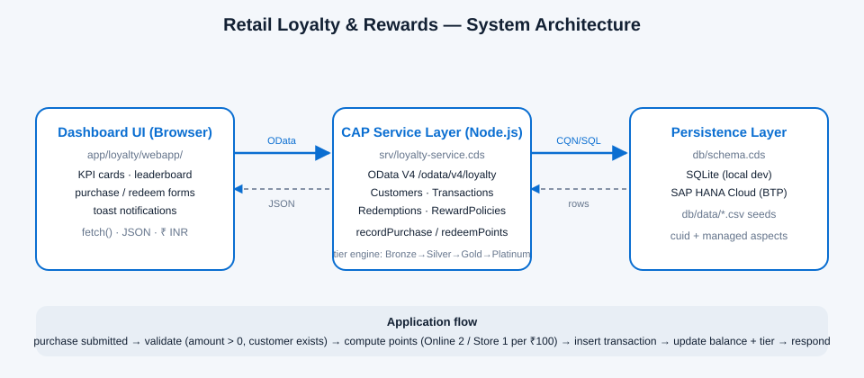
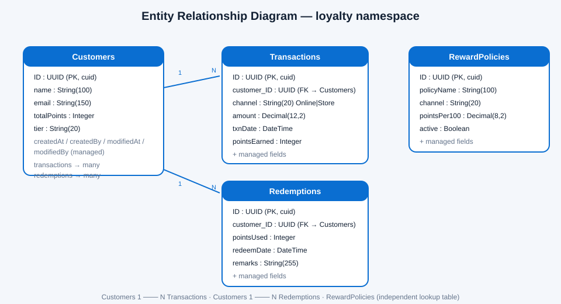
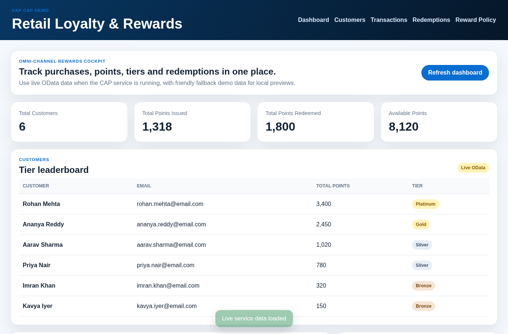
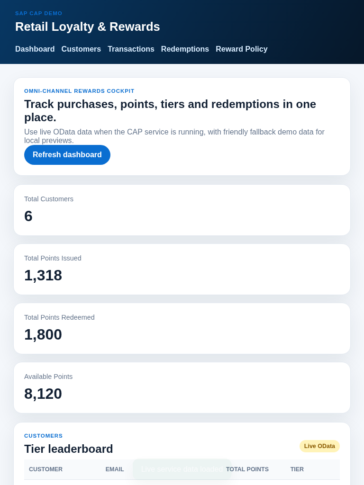
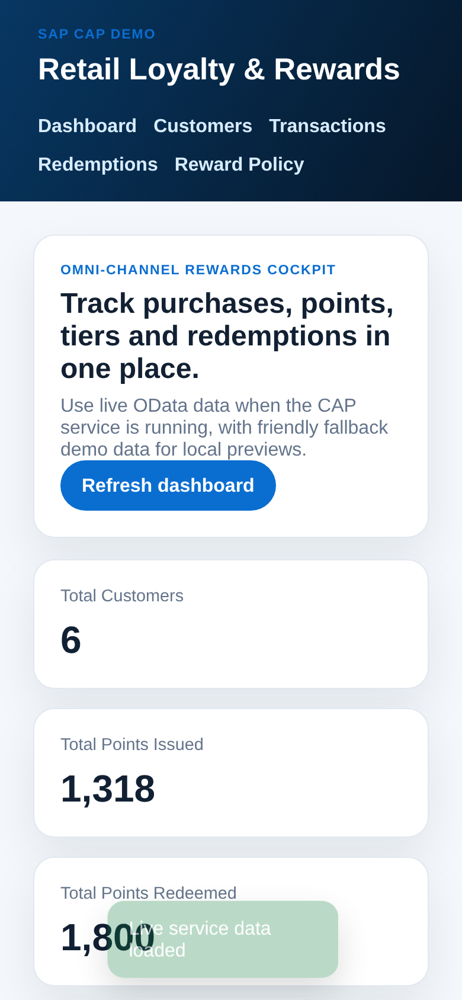
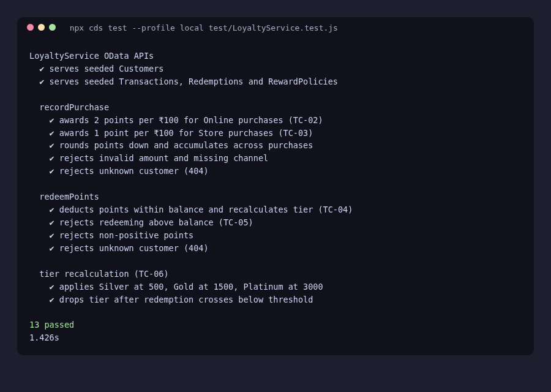
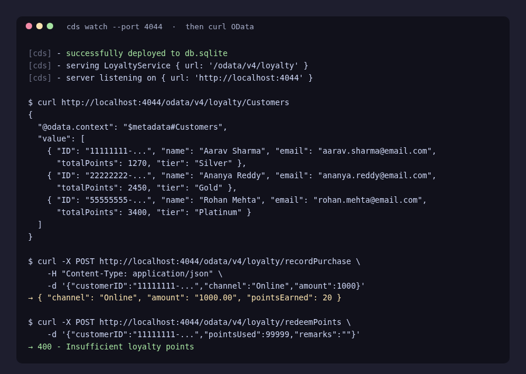
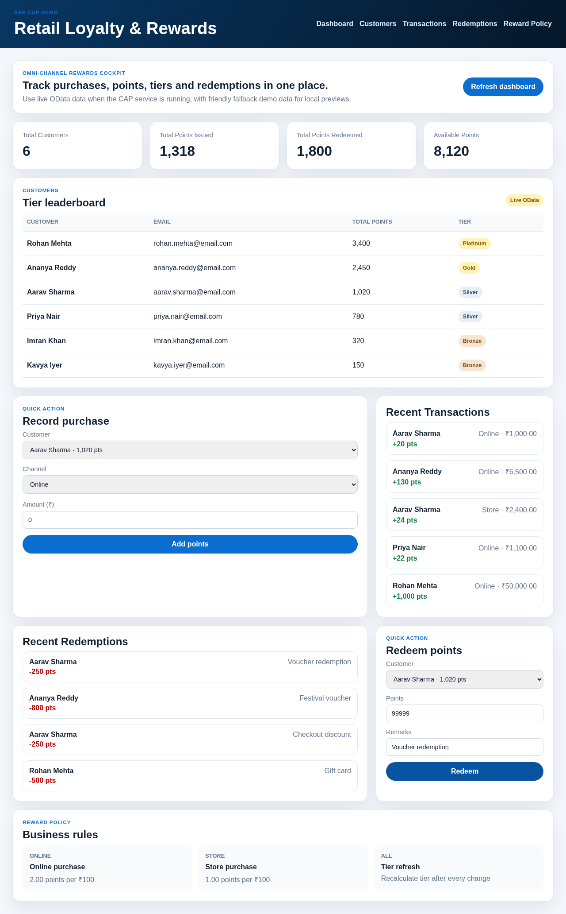

# Retail Loyalty & Rewards — SAP CAP Project Documentation

A full-stack omni-channel retail customer loyalty and rewards system built on the
SAP Cloud Application Programming Model (CAP), Node.js.

---

## 1. Project Overview

### 1.1 Project Title
**Retail Loyalty & Rewards — Omni-Channel Loyalty Management on SAP CAP**

### 1.2 Business Scenario
A retail chain sells through two channels — **Online** and **Store**. Every purchase earns
loyalty points, and points can be redeemed against vouchers and discounts. Customers move up
tiers (Bronze → Silver → Gold → Platinum) as their balance grows, which drives repeat business.

### 1.3 Problem Statement
Manual, channel-siloed loyalty tracking is error-prone: points miscalculated per channel,
balances drifting out of sync, and no single dashboard for staff. The business needs one
system that:

- computes points consistently per channel,
- keeps balances and tiers consistent in real time,
- blocks over-redemption,
- gives staff a single live cockpit.

### 1.4 Objective
Deliver a CAP-based loyalty service exposing all entities over **OData V4** with two custom
actions (`recordPurchase`, `redeemPoints`), a live dashboard with KPI cards and quick actions,
automated tests, and seed data — deployable to SAP BTP with SAP HANA Cloud.

### 1.5 Scope
**In scope:** Customers, Transactions, Redemptions, RewardPolicies; point computation
(Online = 2 pts / ₹100, Store = 1 pt / ₹100); redemption validation; tier recalculation;
dashboard UI; seed data; automated tests; deployment guides.

**Out of scope:** Authentication/authorization, multi-tenant isolation, refunds/reversals,
real-time notifications.

### 1.6 User Roles
- **Customer** — earns and spends points via purchases and redemptions.
- **Store staff / cashier** — records purchases and redemptions at the till.
- **Loyalty admin** — monitors KPIs, customer tiers, and reward policies.

### 1.7 Key Features
- OData V4 CRUD for 4 entities + 2 custom actions
- Channel-aware point engine with floor rounding
- Insufficient-balance and invalid-input validation with user-friendly errors
- Automatic tier recalculation after every purchase and redemption
- Live dashboard with KPI cards, tier leaderboard, activity feeds, quick actions, toast feedback
- Demo-mode fallback when the service is offline
- Seed data (6 customers, 6 transactions, 3 redemptions, 3 policies)
- 13 automated tests + browser smoke test

### 1.8 Technology Stack
| Layer | Technology |
|---|---|
| Backend | Node.js 22, @sap/cds 10, CDS (Core Data Services) |
| Protocol | OData V4 |
| Database | SQLite (local) / SAP HANA Cloud (BTP production) |
| Frontend | Vanilla HTML/CSS/JS (no build step) |
| Testing | @cap-js/cds-test, chai, headless Chrome smoke test |
| Deployment | SAP BTP Cloud Foundry, SAP HANA HDI, Business Application Studio |

---

## 2. System Architecture

### 2.1 Architecture Diagram

### 2.2 Application Flow
1. Staff opens the dashboard; it fetches all four entity sets from `/odata/v4/loyalty/`.
2. Recording a purchase POSTs `recordPurchase {customerID, channel, amount}`.
3. The handler validates, computes points (`amount / 100 × rate`), inserts the transaction,
   updates the customer's `totalPoints`, and recomputes `tier`.
4. Redeeming POSTs `redeemPoints {customerID, pointsUsed, remarks}`; the handler rejects
   over-redemption, deducts the balance, and recomputes the tier.
5. The dashboard re-reads the entities and updates KPIs, lists, and toasts.

### 2.3 Component Description
- **`db/schema.cds`** — domain model: Customers, Transactions, Redemptions, RewardPolicies
  (all `cuid` + `managed`).
- **`srv/loyalty-service.cds`** — service definition: projections + actions, OData V4 at
  `/odata/v4/loyalty`.
- **`srv/loyalty-service.js`** — action implementations and the tier engine.
- **`app/loyalty/webapp/`** — static dashboard served by CAP.
- **`db/data/*.csv`** — seed data auto-loaded on deploy.
- **`test/`** — automated API tests + browser smoke script.

---

## 3. Data Model Design

### 3.1 Entity Relationship Diagram

### 3.2 Customer Entity
`Customers : cuid, managed` — `name`, `email`, `totalPoints` (default 0), `tier`
(default 'Bronze'), with `transactions` and `redemptions` backlink associations.

### 3.3 Transaction Entity
`Transactions : cuid, managed` — `customer` association (FK `customer_ID`), `channel`
('Online'|'Store'), `amount` Decimal(12,2), `txnDate`, `pointsEarned`.

### 3.4 Redemption Entity
`Redemptions : cuid, managed` — `customer` association, `pointsUsed`, `redeemDate`, `remarks`.

### 3.5 Relationships
- Customers **1 ─── N** Transactions (a purchase belongs to exactly one customer)
- Customers **1 ─── N** Redemptions
- RewardPolicies is an independent lookup table (channel → points-per-₹100, active flag)

---

## 4. CAP Service Definition

### 4.1 Service Architecture
`LoyaltyService` projects the four `loyalty` namespace entities and adds two
unbound actions. Handlers are bound via the sibling-impl convention (`srv/loyalty-service.js`
next to `srv/loyalty-service.cds`).

### 4.2 Exposed Entities
`Customers`, `Transactions`, `Redemptions`, `RewardPolicies` — all with CRUD over OData V4,
including `customer_ID` foreign-key fields for the dashboard activity lists.

### 4.3 CRUD Operations
Standard OData V4 verbs: `GET /Customers`, `POST /Customers`, `GET /Customers(ID)`,
`PATCH`, `DELETE`. `$select`, `$orderby`, `$top` supported.

### 4.4 Custom Actions
- `recordPurchase(customerID : UUID, channel : String, amount : Decimal(12,2)) → Transactions`
- `redeemPoints(customerID : UUID, pointsUsed : Integer, remarks : String) → Redemptions`

### 4.5 API Endpoints
| Endpoint | Method | Purpose |
|---|---|---|
| `/odata/v4/loyalty/Customers` | GET/POST | List / create customers |
| `/odata/v4/loyalty/Transactions` | GET | Purchase history |
| `/odata/v4/loyalty/Redemptions` | GET | Redemption history |
| `/odata/v4/loyalty/RewardPolicies` | GET | Active reward rules |
| `/odata/v4/loyalty/recordPurchase` | POST | Record purchase, earn points |
| `/odata/v4/loyalty/redeemPoints` | POST | Redeem points |

---

## 5. Business Logic

### 5.1 Point Calculation
`points = floor(amount / 100 × rate)`.

### 5.2 Channel-Based Rewards
- **Online:** 2 points per ₹100
- **Store:** 1 point per ₹100

### 5.3 Redemption Validation
- Customer must exist (404 otherwise)
- `pointsUsed` must be positive (400 otherwise)
- `pointsUsed` must not exceed `totalPoints` (400 "Insufficient loyalty points")

### 5.4 Point Deduction
On redemption, `totalPoints -= pointsUsed` and the tier is recomputed immediately —
a big redemption can downgrade a customer.

### 5.5 Error Handling
Handlers return `req.error(status, message)`; the dashboard renders `error.error.message`
in a red toast. Tiers: ≥3000 Platinum, ≥1500 Gold, ≥500 Silver, else Bronze.

---

## 6. Agile Sprint Plan

### 6.1 Sprint 1 — Entity model, mock data, service definitions
CDS schema, service projections, action signatures. *(commit: first commit)*

### 6.2 Sprint 2 — Point computation and redemption logic
Action handlers, validation, tier engine. *(commits: Details)*

### 6.3 Sprint 3 — Fiori dashboard
Static HTML/CSS/JS dashboard with KPIs, quick actions, demo-mode fallback.
*(commits: Complete loyalty frontend dashboard)*

### 6.4 Sprint 4 — Deployment and testing
Seed data, 13 automated tests, browser smoke test, deployment guides, screenshots.
*(this sprint)*

### 6.5 User Stories
- As staff, I record a purchase so the customer earns the right points for the channel.
- As staff, I redeem points so the balance drops by exactly the redeemed amount.
- As admin, I see KPIs and tiers so I can spot our best customers.

### 6.6 Acceptance Criteria
- TC-01..TC-06 pass in the automated suite (see §8)
- Dashboard shows "Live OData" against a running service
- Error toasts appear for invalid input and insufficient balance

---

## 7. SAPUI5/Fiori Application

### 7.1 Customer Dashboard
KPI cards (customers, points issued, redeemed, available), tier leaderboard table,
recent transactions and redemptions feeds.

### 7.2 Staff Functionality
Quick-action forms for recording a purchase and redeeming points, with live validation
and toast feedback.

### 7.3 Admin Dashboard
Reward-policy cards (Online 2/₹100, Store 1/₹100, tier refresh rule).

### 7.4 Screenshots

Desktop (1366px):

Tablet (768px):

Mobile (390px):

*Decision note: the dashboard deliberately stays plain HTML/CSS/JS rather than SAPUI5/
Fiori Elements. It has zero build step, renders instantly in BAS and BTP static hosting,
and the CAP service already exposes full OData v4 so a Fiori Elements app can be added
later without backend changes.*

---

## 8. Test Case Sheet

### 8.1 Functional Tests
Customer creation (Bronze default), entity reads, activity feeds.

### 8.2 Business Logic Tests
Online/store point rates, floor rounding, accumulation across purchases.

### 8.3 Validation Tests
Invalid amount, missing channel, unknown customer, over-redemption, non-positive redemption.

### 8.4 Test Results

**13/13 passing.** Full mapping in `docs/TEST_CASE_SHEET.txt`.

---

## 9. Deployment

### 9.1 Prerequisites
Node.js 22+, npm, SAP Business Application Studio (for BTP), SAP HANA Cloud instance.

### 9.2 BTP Configuration
HANA HDI container service instance + Cloud Foundry org/space.

### 9.3 Build
`npm run build` (produces `gen/` artifacts).

### 9.4 Cloud Foundry Deployment
`cf push` or `mbt build && cf deploy` — full steps in `docs/DEPLOYMENT.txt`.

### 9.5 Deployment Commands
See `docs/DEPLOYMENT.txt` and `HANA_Deployment_Guide.md`.

### 9.6 Verification

---

## 10. Results & Screenshots

Live-service verification (dashboard against `cds watch`):

- Seeded data loads immediately after startup (6 customers, 4 tiers represented).
- `recordPurchase` live: Aarav Sharma ₹1,000 Online → +20 pts, balance 1,250→1,270,
  KPI "Points Issued" 1,298→1,318, new activity row.
- `redeemPoints` live: 250-pt redemption → balance 1,270→1,020,
  KPI "Points Redeemed" 1,550→1,800, new redemption row.
- Error paths live: ₹0 purchase → "Valid customer, channel and amount are required";
  99,999-pt redemption → "Insufficient loyalty points" (both as red toasts).
- Browser smoke test (`npm run test:smoke`) — 11/11 assertions pass.

---

## 11. Challenges & Solutions

| Challenge | Solution |
|---|---|
| Tests hit `no such table` in-memory | Removed explicit sqlite file credentials from default config so `cds test --in-memory?` bootstraps a clean in-memory DB; `deploy:local` still writes the file DB explicitly |
| `test:unit` script pointed at a non-existent file | Corrected to `test/LoyaltyService.test.js` |
| Managed CSV headers were incomplete | Regenerated CSVs with minimal columns (ID, business fields, FKs); CAP fills managed columns on deploy |
| Tier math bug in a test (₹75,000 online ≠ 3,000 pts) | Fixed test input to ₹150,000 → exactly 3,000 pts (2 pts/₹100) |
| Background shells resolve system node v20 | Exported absolute nvm node v22 PATH in server and smoke-script launches |

## 12. Learning Outcomes
- CAP action handlers, `req.error`, and sibling-impl discovery
- CDS associations → `customer_ID` FK exposure in OData projections
- CSV seed data mechanics and minimal-column seeding
- `cds test` in-memory bootstrap behavior
- Building a zero-build static UI against OData v4 with graceful fallback

## 13. Conclusion
The project delivers a complete, tested, and verified omni-channel loyalty system:
consistent channel-based point earning, guarded redemption, automatic tiering, a live
dashboard, realistic seed data, 13 automated tests, and a browser smoke gate — packaged
with full deployment documentation for SAP BTP and HANA Cloud.
